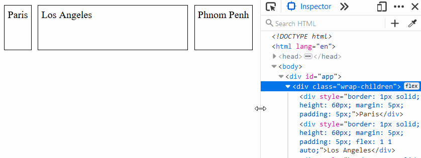

# flex-wrap-layout

[](https://www.npmjs.com/package/flex-wrap-layout)
[](https://github.com/tkrotoff/flex-wrap-layout/actions)
[](https://bundlephobia.com/result?p=flex-wrap-layout)
[](https://github.com/prettier/prettier)
[](https://github.com/airbnb/javascript)

Detects flex-wrap via JavaScript ([unfortunately not possible in CSS](https://stackoverflow.com/q/40012428)).

[`detectWrappedElements()`](src/detectWrappedElements.ts) and [`useDetectWrappedElements()`](src/useDetectWrappedElements.ts) are JavaScript functions that detect when elements are wrapped and let you [define the CSS](src/detectWrappedElements.scss) that goes with it.

This allows for responsive UIs without hardcoded CSS (width, min-width, media queries...) using the "natural" width of elements instead.

- With `detectWrappedElements()`:


- Without:



## Usage

`npm install flex-wrap-layout`

```JS
import { useRef } from 'react';

import { useDetectWrappedElements, wrapChildrenClassName } from 'flex-wrap-layout';
import 'flex-wrap-layout/src/detectWrappedElements.scss';

const boxStyle = {
  border: '1px solid',
  height: 60,
  margin: 5,
  padding: 5
};

function MyComponent() {
  const ref = useRef(null);
  useDetectWrappedElements(ref);

  return (
    <div ref={ref} className={wrapChildrenClassName}>
      <div style={boxStyle}>Paris</div>
      <div style={{ ...boxStyle, flex: 'auto' }}>Los Angeles</div>
      <div style={boxStyle}>Phnom Penh</div>
    </div>
  );
}
```

## Examples

- [Minimal example](examples/Minimal.tsx)
- [Boxes example](examples/Boxes.tsx)
- [Bootstrap example](examples/Bootstrap.tsx): https://codesandbox.io/s/github/tkrotoff/flex-wrap-layout/tree/codesandbox.io/examples

## Limitations

This will cause reflows (layout thrashing): https://gist.github.com/paulirish/5d52fb081b3570c81e3a
